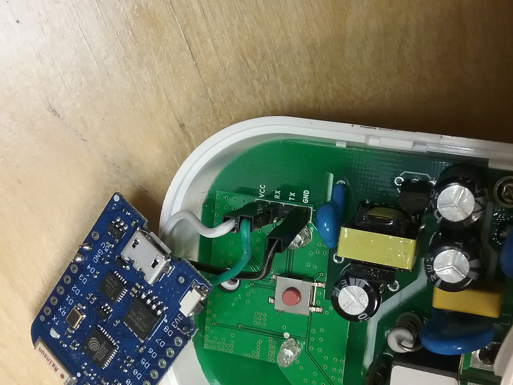

<!-- vim: tw=80
-->

# Embedded reservation system

ESP8266 project which has a reservation system. Uses [O-DF](http://www.opengroup.org/iot/odf/index.htm)/[O-MI](http://www.opengroup.org/iot/omi/index.htm) protocols for control.

Components
----------

* [Sonoff smart socket](https://www.itead.cc/smart-socket-eu.html) (€11.80)
* ESP8266 for better extension possibilities. I used
  [Wemos mini](https://www.aliexpress.com/store/product/D1-mini-Mini-NodeMcu-4M-bytes-Lua-WIFI-Internet-of-Things-development-board-based-ESP8266/1331105_32529101036.html?spm=2114.12010615.0.0.aHT9H7)
  (€3.74)
* USB to TTL adapter (3.3V recommended) for programming Sonoff (~3€)

Sum ~18.54 €

Other software needed
---------------------

Arduino with [esp8266 core](https://github.com/esp8266/Arduino) for building and
uploading programs to hardware.

Some http server for serving the user interface in `UserHtml` directory on the
same server as an O-MI node server.

[O-MI node server](https://github.com/TK009/O-MI/releases/tag/ChargingPole-mechatronics)
with agent for handling the reservations. This link has it preinstalled.

* Run by starting `bin/o-mi-node.sh`
* The device needs a network connection to this server
  * Static IP or DNS address is required
  * Ports need to be open to internet if the server is not used in the same network

* I have test server running at http://otaniemi3d.cs.hut.fi/omi/node/ but it
  might require newer version from branch `master` of this repository.

Reprogramming Sonoff
-------------------

This project uses sonoff only for the relay electronics and packaging. It has
also esp8266 chip which could be used for this project, but it doesn't have
other than serial pins available easily. So for future expansion possibilities I
chose to use another esp8266 for the real program. Anyways sonoff need to be
reprogrammed, which is quite easy.

1. Open `Relay/BlinkX/BlinkX.ino` in Arduino IDE
2. Change board to `Generic ESP8266 Module`
2. Open Sonoff module package to reveal the circuit board
3. Solder a pin header to Sonoff holes marked as VCC, TX, RX, GND
4. Connect USB to TTL adapter to the header (TX to RX, RX to TX, VCC to VCC,
   GND to GND)
5. Before connecting USB to TTL adapter to USB, press down the button in Sonoff
   and keep it pressed while connecting the USB cable.
6. Select right port from Arduino IDE
7. Press Upload

This program only waits for "I" or "O" from serial and sets the relay to
corresponding state.

Programming ESP8266 Module
-------------------------

1. Connect USB cable to ESP8266 and computer.
2. Open Arduino IDE to open `EspRelay/EspRelay.ino` or use Makefile with `make upload` 
3. Change Settings for your Module (WeMos Mini for me)
4. Upload

Assembling
---------

1. Connect esp8266 module serial to Sonoff serial (TX to RX is enough)
2. Connect 3V3 to VCC and GND to GND
3. Done.

How it works
------------

The server stores some reservations in a database. The user interface sends
requests to the server to store information. The esp program polls the server
for information every n seconds and fetches internet time with SNTP protocol.
Then it compares the internet time to the reservation start and end times to see
if one is active. If it is, then it sends relay a command to turn it on or off.

How to use
----------

1. Plug the device in a wall socket
2. Go to the user interface with browser `register.html` ([or use the demo server](https://otaniemi3d.cs.hut.fi/PoleFront/register.html))
3. Write some user name and pass and press `Register`.
4. Select date and time when the socket should turn on.
5. Write duration in seconds before turning off.
6. Press `Reserve`
7. Done. You should see the device make action at the specified time
   (+-30 seconds)

Sources
-------

* This repository for software for the hardware.
* [Server Agent source file for O-MI Node server at here](https://github.com/TK009/O-MI/blob/e0a594b443fa4e8225dd8532aa3a301d6bfb217f/Agents/src/main/scala/agents/ChargingPoleAgent.scala)
  * or as [a complete package here](https://github.com/TK009/O-MI/releases/tag/ChargingPole-mechatronics)

